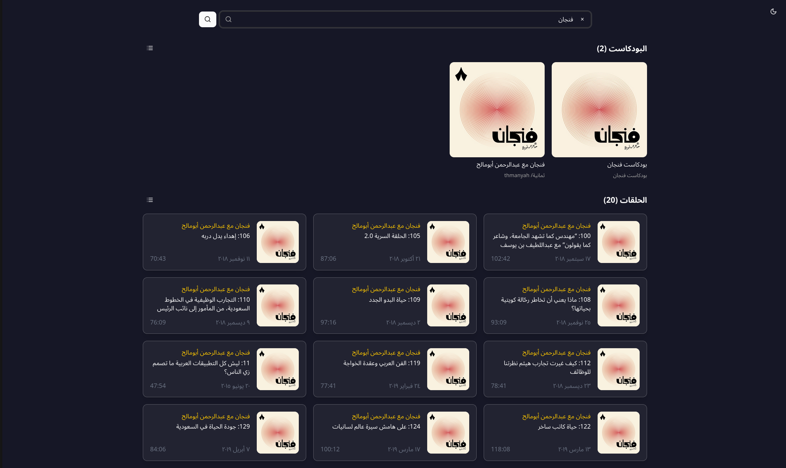

# iTunes Search App

A modern Next.js web application for searching podcasts and episodes from iTunes Search API.

## 📱 Preview


## 🌟 Features

- **Comprehensive Search**: Search for podcasts and episodes from iTunes Store
- **Multiple Views**: Toggle between grid view and horizontal scroll view
- **Theme Switcher**: Support for light, dark, and system themes
- **Infinite Loading**: Automatic loading of more results on scroll
- **Fully Responsive**: Works seamlessly across all screen sizes

## 🛠️ Tech Stack

- **Next.js 15**: React framework with App Router
- **TypeScript**: Type-safe development
- **Tailwind CSS**: Utility-first CSS framework
- **next-themes**: Theme management
- **Lucide React**: Beautiful icons
- **TanStack Query**: Data fetching and state management
- **Shadcn UI**: UI components library

## 🚀 Quick Start

### Option 1: Easy Startup Scripts (Recommended)

The easiest way to run the application with database in Docker and Next.js locally:

**Linux/Mac:**
```bash
# Make script executable
chmod +x start-app.sh

# Start database + Next.js
./start-app.sh
```

**Windows:**
```bash
# Start database + Next.js
start-app.bat
```

**Services will be available at:**
- **Frontend**: http://localhost:3000
- **Database Admin (pgAdmin)**: http://localhost:8080
  - Email: admin@example.com
  - Password: admin123

**Script Options:**
```bash
# Stop only database services
./start-app.sh --stop        # Linux/Mac
start-app.bat --stop         # Windows

# Start only database (run Next.js separately)
./start-app.sh --db-only     # Linux/Mac
start-app.bat --db-only      # Windows

# Show service status
./start-app.sh --status      # Linux/Mac
start-app.bat --status       # Windows
```

### Option 2: Manual Setup

### Prerequisites
- Node.js 18+
- PostgreSQL 15+
- npm, yarn, or pnpm

### Installation

```bash
# 1. Start database services
docker-compose up -d

# 2. Install dependencies
npm install --legacy-peer-deps

# 3. Generate Prisma client
npm run db:generate

# 4. Push database schema
npm run db:push

# 5. Start development server
npm run dev
```

Open [http://localhost:3000](http://localhost:3000) in your browser to see the application.

## 📁 Project Structure

```
src/
├── app/                 # App Router pages
├── components/          # React components
├── hooks/              # Custom hooks
├── lib/                # Utility functions
├── registry/           # UI components library
└── styles/             # Global styles
prisma/                 # Database schema and migrations
docker-compose.yml      # Docker services configuration
Dockerfile             # Frontend container configuration
```

## 🐳 Docker Configuration

The application uses Docker only for database services:

- **Database**: PostgreSQL 15 (Docker)
- **Admin Interface**: pgAdmin for database management (Docker)
- **Frontend**: Next.js application (Local)

### Services

| Service | Port | Type | Description |
|---------|------|------|-------------|
| postgres | 5432 | Docker | PostgreSQL database |
| pgadmin | 8080 | Docker | Database admin interface |
| frontend | 3000 | Local | Next.js application |

## 🔧 Key Components

- **PodcastSection**: Displays podcast listings with grid/horizontal views
- **EpisodeSection**: Shows episode listings with play buttons
- **ThemeSwitcher**: Theme toggle component with Arabic labels
- **SearchForm**: Search input with keyboard shortcuts

## 🗄️ Database

The application uses PostgreSQL with Prisma ORM:
- **Database**: PostgreSQL 15
- **ORM**: Prisma
- **Admin**: pgAdmin interface
- **Schema**: Auto-generated from Prisma models

### Database Configuration

```env
POSTGRES_DB=itunes_search
POSTGRES_USER=itunes_user
POSTGRES_PASSWORD=itunes_password
POSTGRES_HOST=localhost
POSTGRES_PORT=5432
```

### Database Commands

```bash
# Generate Prisma client
npm run db:generate

# Push schema to database
npm run db:push

# Open Prisma Studio
npm run db:studio
```

## 🚀 Deployment

### Docker Deployment

1. Clone the repository
2. Run `docker-compose up -d`
3. Access the application at http://localhost:3000

### Production Deployment

The application is production-ready with:
- Optimized Docker images
- Health checks
- Proper environment configuration
- Database persistence

## 📄 License

This project is licensed under the MIT License - see the [LICENSE](LICENSE) file for details.
